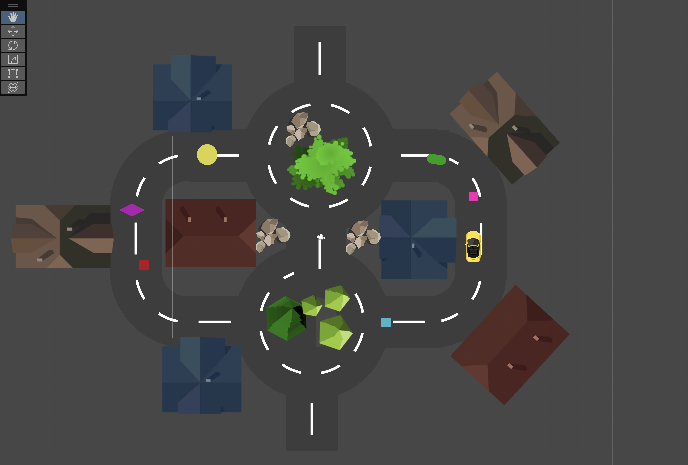

# Delivery Game

This is a very simple 2D game made in Unity, based on Udemy's [Complete C# Unity Game Developer 2D](https://www.udemy.com/course/unitycourse/) course!

Here is a list of the implemented functionalities:
  - Collision Detection
  - Destroying Objects
  - Controlling the player
  - Adding/Reducing Speed
    

